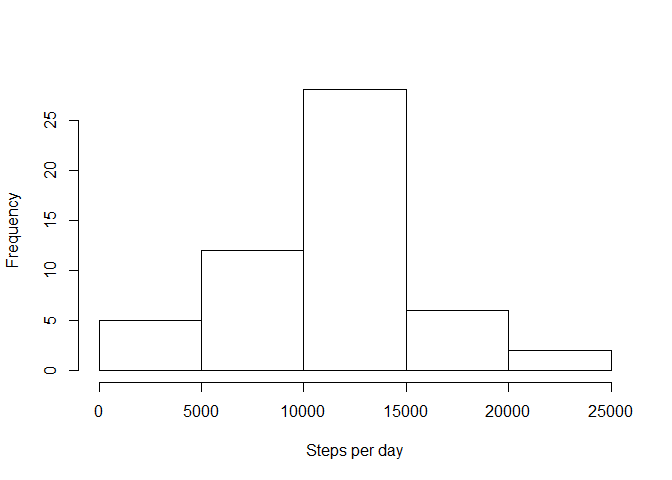
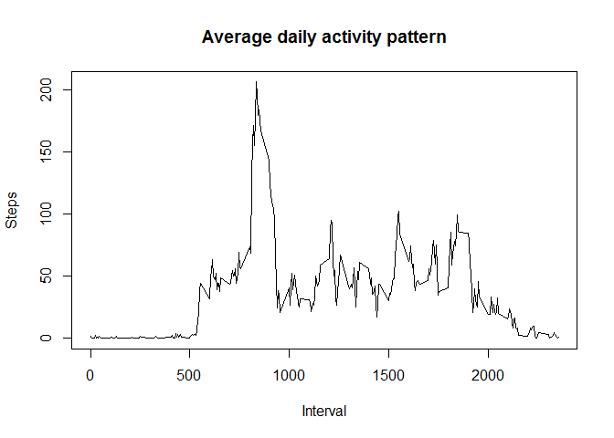
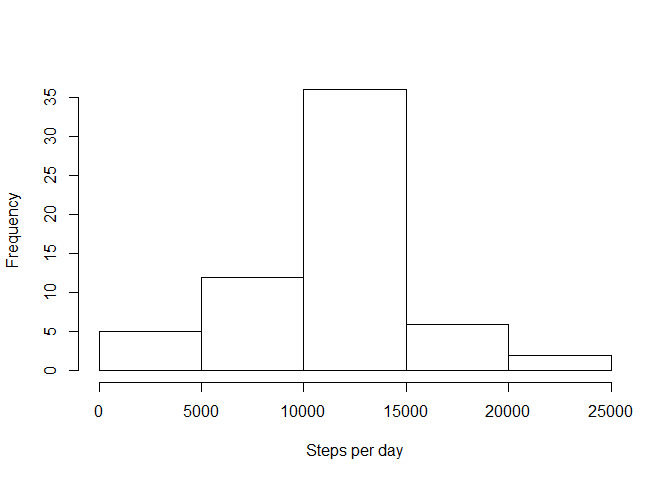

# Reproducible Research: Peer Assessment 1


## Loading and preprocessing the data

The code presumes that the starting data are downloaded into the working directory and unzipped. 

```r
act <- read.csv("activity.csv")
library(dplyr)
library(tidyr)
act <- tbl_df(act)
act_compl <- act[complete.cases(act), ]
```

## What is mean total number of steps taken per day?

mean number of steps per day - **mean_steps**, median number of steps - **median_steps**

```r
act_date <- group_by(act_compl, date)
steps_per_day <- summarise_each(act_date, funs(sum))
hist(steps_per_day$steps, main = "", xlab = "Steps per day")
```

 

```r
mean_steps <- mean(steps_per_day$steps)
median_steps <- median(steps_per_day$steps)
```

```r
print(mean_steps)
```

```
## [1] 10766.19
```

```r
print(median_steps)
```

```
## [1] 10765
```

## What is the average daily activity pattern?


```r
act_int <- group_by(act_compl, interval)
act_int <- select(act_int, interval, steps)
act_int_mean <- summarise_each(act_int, funs(mean))
plot(act_int_mean$interval, act_int_mean$steps, type = "l", main = "Average daily activity pattern", 
    xlab = "Interval", ylab = "Steps")
```

 

This fragment determines a 5-minute interval with maximum number of steps in average **inter_max**

```r
max_steps <- max(act_int_mean$steps)
max_int <- filter(act_int_mean, act_int_mean$steps == max_steps)
inter_max <- max_int$interval[[1]]
print(inter_max)
```

```
## [1] 835
```

## Imputing missing values


```r
NA_number <- nrow(act) - nrow(act_compl)
print(NA_number)
```

```
## [1] 2304
```
This function looks if the element act[i, "steps"] is NA, if TRUE changes it to the value from the data table **act_int_mean**, which is a mean value of steps for that 5-minute interval.

```r
act_corr <- act
for (i in 1:nrow(act)) {
    if (is.na(act$steps[i])) {
        int <- act$interval[i]
        row <- filter(act_int_mean, act_int_mean$interval == int)
        act_corr$steps[i] <- row$steps
    }
}
act_corr_date <- group_by(act_corr, date)
steps_per_day_corr <- summarise_each(act_corr_date, funs(sum))
hist(steps_per_day_corr$steps, main = "", xlab = "Steps per day")
```

 

The histogramm differs from the previous one in the height of the "central bar" corresponding to the number of steps
that are close to the average.


## Are there differences in activity patterns between weekdays and weekends?


```r
day <- lapply(as.vector(act_corr$date), FUN = as.Date)
Sys.setlocale("LC_TIME", "English_United States.1252")
```

```
## [1] "English_United States.1252"
```

```r
wd <- sapply(day, FUN = weekdays)
for (i in 1:length(wd)) {
    if (wd[i] == "Saturday" | wd[i] == "Sunday") 
        wd[i] <- "weekend" else wd[i] <- "weekday"
}
act <- cbind(act_corr, wd)
act <- select(act, steps, interval, wd)
act <- group_by(act, wd, interval)
act_wd_mean <- summarise_each(act, funs(mean))
library(lattice)
xyplot(act_wd_mean$steps ~ act_wd_mean$interval | act_wd_mean$wd, type = "l", 
    layout = c(1, 2), ylab = "Number of steps", xlab = "Interval")
```

 

There are some differences: e.g. on weekends there is no sharp peek in the morning and the activity is more even throughout the day.
